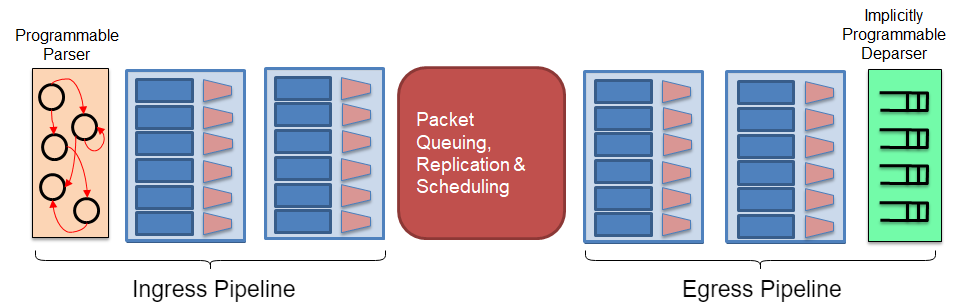

# bmv2-ss-vss


Features that are currently not working:

- verifyChecksum() -
Unable to verify the checksum in the packet correctly, not sure if it's the packet with wrong checksum value or the function is not working properly

- Graphical dumps (PDF,PS) in scapy - Currently not able to generate the graphical dump of the packet


Very Simple Switch (VSS) P4 program with v1model architecture on target software switch (simple_switch) using behavioral-model (bmv2)

This is possibble without using the `very_simple_switch_model.p4` architecture as mentioned in the P4_16 specs because the VSS architecture is a strict subset of v1model (which is available for p4c), as mentioned by one of the P4 contributors [here](https://github.com/p4lang/p4-spec/issues/597).

Based on my understanding, the `v1model.p4` architecture consists of the following things, programmed in P4:
* parser
* ingress match-action pipeline
Then there is a packet replication engine and packet buffer, which are not P4-programmable.
* egress match-action pipeline
* deparser

Here is the diagram of the [v1model.p4](misc/v1model.p4) architecture:


## Dependencies 

To be able to compile P4 programs and running the P4 program on a target software switch, ther are multiple dependencies that are required. 

### 1) Fast way

I suggest using the install script `bin/install-p4dev.sh` provided in [this](https://github.com/jafingerhut/p4-guide) repository to install everything so that it can save your time going through the README documents in all the dependencies repositories.

Prerequisite: 
- Fresh Ubuntu Linux 16.04 installation
- Atleast 20GB of disk space available on the system

Then run the following commands, then typing in your password a couple of times when various commands need superuser privileges:

```
$ sudo apt install git
$ git clone https://github.com/jafingerhut/p4-guide
$ ./p4-guide/bin/install-p4dev.sh

then if you wish to run tests

$ cd p4c/build
$ make check
```

if you run the `install-p4dev.sh` script successfully, it installs these things:
- The library called Thrift, which is a prerequisite for compiling the behavioral-model simple_switch code
- behavioral-model simple_switch, a software switch that can run P4 programs that you compile using p4c
- The Google Protobuf library, which is a prerequisite for compiling the p4c compiler
- The P4C compiler

After installing, you can add the commands to your command path (eg. .profile) so you can call the compiler:


**NOTE: Once the install-p4dev.sh script is complete, the print outputs on your terminal will show you the correct directory that you would need to add to your command path.**

```
P4C="/path/to/your/copy/of/p4c"
BMV2="/path/to/your/copy/of/behavioral-model"
P4GUIDE_BIN="/path/to/your/copy/of/p4-guide/bin"
export PATH="$P4GUIDE_BIN:$P4C/build:$BMV2/tools:/usr/local/bin:$PATH"
```

Then restart your system and source the command path file (eg. .profile) using the command:
`source ~/.profile`

Now you can start to use p4c!

### 2) Slow way

Follow README instructions on p4c GitHub page:

https://github.com/p4lang/p4c


# Usage

## Compiling

For basic linting checks on the p4 code, you can use `p4test` with the following commands:

```
p4test my-p4-16-prog.p4
```

To compile the P4_16 program using p4c:

```
p4c --target bmv2 --arch v1model vss_v1.p4
                                 ^^^^^^^^^ source code
```

Running that command will create these files:

    demo1.p4_16.p4i - the output of running only the preprocessor on
        the P4 source program.
    demo1.p4_16.json - the JSON file format expected by BMv2
        behavioral model `simple_switch`.

Only the file with the `.json` suffix is needed to run your P4 program
using the `simple_switch` command.  You can ignore the file with
suffix `.p4i` unless you suspect that the preprocessor is doing
something unexpected with your program.

The .dot and .png files in the subdirectory 'graphs' were created with
the p4c-graphs program, which is also installed when you build and
install p4c:


The following command generate GraphViz ".dot" files:

```
p4c-graphs -I $HOME/p4c/p4include vss_v1.p4
```

To convert the dot files to png files, use the following command:

```
dot -Tpng ingress.dot > ingress.png
```

## Running

To create veth interfaces:

```
source ~/.profile
sudo $BMV2/tools/veth_setup.sh
```

To run the behavioral model with 8 ports numbered 0 through 7:

    sudo simple_switch --log-console -i 0@veth2 -i 1@veth4 -i 2@veth6 -i 3@veth8 -i 4@veth10 -i 5@veth12 -i 6@veth14 -i 7@veth16 vss_v1.json

To run CLI for controlling and examining simple_switch's table
contents:

    simple_switch_CLI

General syntax for table_add commands at simple_switch_CLI prompt:

    RuntimeCmd: help table_add
    Add entry to a match table: table_add <table name> <action name> <match fields> => <action parameters> [priority]

Commands found in `table_add_commands.txt`:

```
### You can omit the table_set_default commands as 
### it has been set during compile time on software switch

table_set_default ipv4_match my_drop
table_set_default check_ttl NoAction
table_set_default dmac my_drop
table_set_default smac my_drop

table_add ipv4_match Set_nhop 10.1.1.200/24 => 10.1.1.220 4
table_add check_ttl Send_to_cpu 0 =>
table_add dmac Set_dmac 10.1.1.220 => 08:de:ad:be:ef:00
table_add smac Set_smac 4 => ca:fe:ba:be:d0:0d
```

In the terminal with the behavioral model running, you should see something similar to the following for each table entry added: 

```
[20:46:07.314] [bmv2] [T] [thread 12370] bm_get_config
[20:46:39.094] [bmv2] [T] [thread 12370] bm_table_add_entry
[20:46:39.094] [bmv2] [D] [thread 12370] Entry 0 added to table 'ingress.ipv4_match'
[20:46:39.095] [bmv2] [D] [thread 12370] Dumping entry 0
Match key:
* headers.ip.dstAddr  : LPM       0a0101c8/24
Action entry: ingress.Set_nhop - a0101dc,4,
```


### Explanation of the `table_add` commands:

1. `table_add ipv4_match Set_nhop 10.1.1.200/24 => 10.1.1.220 4` - Adds entry to table `ipv4_match` for action `Set_nhop` to match the value (`10.1.1.200/24`) with `ip.dstAddr` in the header of the packet. If matched, the `Set_nhop` action will take in the value (`10.1.1.220 4`) set in the table and execute the action.

2. `table_add check_ttl Send_to_cpu 0 =>` - Adds entry to table `check_ttl` for action `Send_to_cpu`. If the ttl is 0, it will carry out the action `Send_to_cpu`.


### Sending/Receiving packets

Any process that you want to have permission to send and receive
packets on Ethernet interfaces (such as the veth virtual interfaces)
must run as the super-user root, hence the use of `sudo`. You could use tcpdump/scapy to send/receive packets, but for this example I will use scapy to send and receive packets.

* Sending Packets:

Here I first created a packet with multiple layers (Ethernet, IP, TCP). Then I send the packet via the interface.

```
sudo scapy

pkt1=Ether() / IP(dst='10.1.1.200',ttl=3) / TCP(sport=5793, dport=80)

# Send packet at layer2, specifying interface
sendp(pkt1, iface="veth2")
```

In the terminal with the behavioral model running, you should see something similar to the following:

```
[20:49:14.536] [bmv2] [D] [thread 12342] [0.0] [cxt 0] Processing packet received on port 0
[20:49:14.536] [bmv2] [D] [thread 12342] [0.0] [cxt 0] Parser 'parser': start
[20:49:14.536] [bmv2] [D] [thread 12342] [0.0] [cxt 0] Parser 'parser' entering state 'start'
[20:49:14.536] [bmv2] [D] [thread 12342] [0.0] [cxt 0] Extracting header 'ethernet'
[20:49:14.536] [bmv2] [D] [thread 12342] [0.0] [cxt 0] Parser state 'start': key is 0800
[20:49:14.536] [bmv2] [T] [thread 12342] [0.0] [cxt 0] Bytes parsed: 14
[20:49:14.536] [bmv2] [D] [thread 12342] [0.0] [cxt 0] Parser 'parser' entering state 'parse_ipv4'
[20:49:14.536] [bmv2] [D] [thread 12342] [0.0] [cxt 0] Extracting header 'ip'
[20:49:14.536] [bmv2] [D] [thread 12342] [0.0] [cxt 0] Parser state 'parse_ipv4' has no switch, going to default next state
[20:49:14.536] [bmv2] [T] [thread 12342] [0.0] [cxt 0] Bytes parsed: 34
[20:49:14.536] [bmv2] [D] [thread 12342] [0.0] [cxt 0] Verifying checksum 'cksum': false
[20:49:14.536] [bmv2] [E] [thread 12342] [0.0] [cxt 0] Checksum 'cksum' is not correct
[20:49:14.536] [bmv2] [D] [thread 12342] [0.0] [cxt 0] Verifying checksum 'cksum_0': true
[20:49:14.536] [bmv2] [D] [thread 12342] [0.0] [cxt 0] Parser 'parser': end
[20:49:14.536] [bmv2] [D] [thread 12342] [0.0] [cxt 0] Pipeline 'ingress': start
[20:49:14.536] [bmv2] [T] [thread 12342] [0.0] [cxt 0] Applying table 'tbl_act'
[20:49:14.536] [bmv2] [D] [thread 12342] [0.0] [cxt 0] Looking up key:

[20:49:14.536] [bmv2] [D] [thread 12342] [0.0] [cxt 0] Table 'tbl_act': miss
[20:49:14.536] [bmv2] [D] [thread 12342] [0.0] [cxt 0] Action entry is act_0 - 
[20:49:14.536] [bmv2] [T] [thread 12342] [0.0] [cxt 0] Action act_0
[20:49:14.536] [bmv2] [T] [thread 12342] [0.0] [cxt 0] Primitive (no source info)
[20:49:14.536] [bmv2] [T] [thread 12342] [0.0] [cxt 0] vss_v1.p4(198) Condition "standard_metadata.parser_error != error.NoError" (node_3) is false
[20:49:14.536] [bmv2] [T] [thread 12342] [0.0] [cxt 0] Condition "node_6" (node_6) is true
[20:49:14.536] [bmv2] [T] [thread 12342] [0.0] [cxt 0] Applying table 'ingress.ipv4_match'
[20:49:14.536] [bmv2] [D] [thread 12342] [0.0] [cxt 0] Looking up key:
* headers.ip.dstAddr  : 0a0101c8

[20:49:14.536] [bmv2] [D] [thread 12342] [0.0] [cxt 0] Table 'ingress.ipv4_match': hit with handle 0
[20:49:14.536] [bmv2] [D] [thread 12342] [0.0] [cxt 0] Dumping entry 0
Match key:
* headers.ip.dstAddr  : LPM       0a0101c8/24
Action entry: ingress.Set_nhop - a0101dc,4,

[20:49:14.536] [bmv2] [D] [thread 12342] [0.0] [cxt 0] Action entry is ingress.Set_nhop - a0101dc,4,
[20:49:14.536] [bmv2] [T] [thread 12342] [0.0] [cxt 0] Action ingress.Set_nhop
[20:49:14.536] [bmv2] [T] [thread 12342] [0.0] [cxt 0] vss_v1.p4(137) Primitive meta.nextHop = ipv4_dest
[20:49:14.536] [bmv2] [T] [thread 12342] [0.0] [cxt 0] vss_v1.p4(138) Primitive headers.ip.ttl = headers.ip.ttl-1
[20:49:14.536] [bmv2] [T] [thread 12342] [0.0] [cxt 0] vss_v1.p4(139) Primitive standard_metadata.egress_spec = port
[20:49:14.536] [bmv2] [T] [thread 12342] [0.0] [cxt 0] vss_v1.p4(140) Primitive meta.egress_port = port
[20:49:14.536] [bmv2] [T] [thread 12342] [0.0] [cxt 0] Applying table 'ingress.check_ttl'
[20:49:14.536] [bmv2] [D] [thread 12342] [0.0] [cxt 0] Looking up key:
* headers.ip.ttl      : 02

[20:49:14.536] [bmv2] [D] [thread 12342] [0.0] [cxt 0] Table 'ingress.check_ttl': miss
[20:49:14.536] [bmv2] [D] [thread 12342] [0.0] [cxt 0] Action entry is NoAction - 
[20:49:14.536] [bmv2] [T] [thread 12342] [0.0] [cxt 0] Action NoAction
[20:49:14.536] [bmv2] [T] [thread 12342] [0.0] [cxt 0] Applying table 'ingress.dmac'
[20:49:14.536] [bmv2] [D] [thread 12342] [0.0] [cxt 0] Looking up key:
* meta.nextHop        : 0a0101dc

[20:49:14.536] [bmv2] [D] [thread 12342] [0.0] [cxt 0] Table 'ingress.dmac': hit with handle 0
[20:49:14.536] [bmv2] [D] [thread 12342] [0.0] [cxt 0] Dumping entry 0
Match key:
* meta.nextHop        : EXACT     0a0101dc
Action entry: ingress.Set_dmac - 8deadbeef00,

[20:49:14.536] [bmv2] [D] [thread 12342] [0.0] [cxt 0] Action entry is ingress.Set_dmac - 8deadbeef00,
[20:49:14.536] [bmv2] [T] [thread 12342] [0.0] [cxt 0] Action ingress.Set_dmac
[20:49:14.536] [bmv2] [T] [thread 12342] [0.0] [cxt 0] vss_v1.p4(180) Primitive headers.ethernet.dstAddr = dmac
[20:49:14.536] [bmv2] [D] [thread 12342] [0.0] [cxt 0] Pipeline 'ingress': end
[20:49:14.536] [bmv2] [D] [thread 12342] [0.0] [cxt 0] Egress port is 4
[20:49:14.536] [bmv2] [D] [thread 12343] [0.0] [cxt 0] Pipeline 'egress': start
[20:49:14.536] [bmv2] [T] [thread 12343] [0.0] [cxt 0] Applying table 'egress.smac'
[20:49:14.536] [bmv2] [D] [thread 12343] [0.0] [cxt 0] Looking up key:
* meta.egress_port    : 0004

[20:49:14.536] [bmv2] [D] [thread 12343] [0.0] [cxt 0] Table 'egress.smac': hit with handle 0
[20:49:14.536] [bmv2] [D] [thread 12343] [0.0] [cxt 0] Dumping entry 0
Match key:
* meta.egress_port    : EXACT     0004
Action entry: egress.Set_smac - cafebabed00d,

[20:49:14.536] [bmv2] [D] [thread 12343] [0.0] [cxt 0] Action entry is egress.Set_smac - cafebabed00d,
[20:49:14.536] [bmv2] [T] [thread 12343] [0.0] [cxt 0] Action egress.Set_smac
[20:49:14.536] [bmv2] [T] [thread 12343] [0.0] [cxt 0] vss_v1.p4(217) Primitive headers.ethernet.srcAddr = smac
[20:49:14.536] [bmv2] [D] [thread 12343] [0.0] [cxt 0] Pipeline 'egress': end
[20:49:14.536] [bmv2] [D] [thread 12343] [0.0] [cxt 0] Deparser 'deparser': start
[20:49:14.536] [bmv2] [D] [thread 12343] [0.0] [cxt 0] Updating checksum 'cksum'
[20:49:14.536] [bmv2] [D] [thread 12343] [0.0] [cxt 0] Updating checksum 'cksum_0'
[20:49:14.536] [bmv2] [D] [thread 12343] [0.0] [cxt 0] Deparsing header 'ethernet'
[20:49:14.536] [bmv2] [D] [thread 12343] [0.0] [cxt 0] Deparsing header 'ip'
[20:49:14.536] [bmv2] [D] [thread 12343] [0.0] [cxt 0] Deparser 'deparser': end
[20:49:14.536] [bmv2] [D] [thread 12347] [0.0] [cxt 0] Transmitting packet of size 54 out of port 4
```


You can check the packet that you've created using the following commands:
```
>>> pkt1.summary()
'Ether / IP / TCP 10.0.2.15:5793 > 10.1.1.200:http S'

>>> str(pkt1[0])
"RT\x00\x125\x02\x08\x00'>\x0cn\x08\x00E\x00\x00(\x00\x01\x00\x00\x03\x06\x9f\xf8\n\x00\x02\x0f\n\x01\x01\xc8\x16\xa1\x00P\x00\x00\x00\x00\x00\x00\x00\x00P\x02 \x00a\x1a\x00\x00"

>>> pkt1.show()
###[ Ethernet ]###
  dst= 52:54:00:12:35:02
  src= 08:00:27:3e:0c:6e
  type= 0x800
###[ IP ]###
     version= 4
     ihl= None
     tos= 0x0
     len= None
     id= 1
     flags= 
     frag= 0
     ttl= 3
     proto= tcp
     chksum= None
     src= 10.0.2.15
     dst= 10.1.1.200
     \options\
###[ TCP ]###
        sport= 5793
        dport= http
        seq= 0
        ack= 0
        dataofs= None
        reserved= 0
        flags= S
        window= 8192
        chksum= None
        urgptr= 0
        options= {}

>>> hexdump(pkt1[0])
0000   52 54 00 12 35 02 08 00  27 3E 0C 6E 08 00 45 00   RT..5...'>.n..E.
0010   00 28 00 01 00 00 03 06  9F F8 0A 00 02 0F 0A 01   .(..............
0020   01 C8 16 A1 00 50 00 00  00 00 00 00 00 00 50 02   .....P........P.
0030   20 00 61 1A 00 00                                   .a...
```


* Receiving Packets:

To check the egress packet that was sent by the simple_switch, you can use the scapy sniff function to capture the outgoing packets.

Since I am only sending 1 packet at a time, I am also only expecting 1 packet at a time, therefore `count=1`.

```
sudo scapy
>>> egress_pkt = sniff(iface="veth10", count=1)

```

To check the packets, you can view the packets similarly using the commands mentioned previously:

```
egress_pkt.summary()
str(egress_pkt[0])
egress_pkt[0].show()
hexdump(egress_pkt[0])
```

## References

p4-guide - https://github.com/jafingerhut/p4-guide

p4c - https://github.com/p4lang/p4c

behavioral-model - https://github.com/p4lang/behavioral-model


